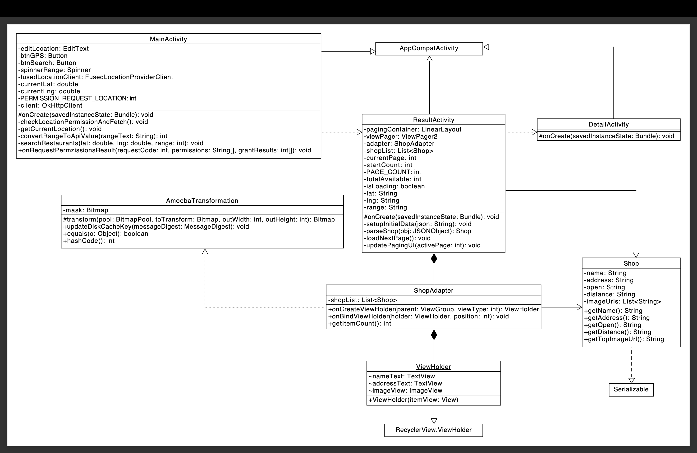

# 簡易仕様書

### 作者
溝口瞳
### アプリ名
RestantSearch

### 対象0S(バージョン情報含む)
Google Pixel 9

## 開発環境
### 開発環境
Android Studio Panda 2 | 2025.3.2

### 開発言語
Java

### 画面概要
- 検索画面 ：現在地を取得し、現在地からの検索半径を指定してレストランを検索する。
- 一覧画面 ：検索結果の飲食店を「1画面1店舗」のスワイプ型で表示する。
- 店舗詳細画面：店舗名、住所、営業時間、画像を表示する。

### 使用しているAPI,SDK,ライブラリなど
- ホットペッパーグルメサーチAPI
- Google Play Services Location
- Glide (v4.16.0)
- OkHttp3 (v4.12.0)
- Material Components

#### コンセプト
スワイプで自分にあったお店を見つけよう！

#### こだわったポイント
多くの一覧型検索ではなく、「1画面1店舗」のスワイプ型UIを採用しました。
これにより情報過多による意思決定の遅延を防ぎ、ユーザーが各店舗に集中して直感的に判断できる設計としています。
比較による負担を減らし、効率的に自分に合った店舗を見つけられる体験の実現を重視しました。

#### デザイン面でこだわったポイント
毎日食べる「お米」のような安心感と親しみやすさを追求し、一粒のお米をイメージした丸みを帯びたデザインを多用しました。
キーカラーに水色を採用したのは、お米の『白』を引き立てる清潔感と、食に不可欠な『水の透明感』を表現するためです。
原色を避け、淡い水色を用いることで、デザイン全体の柔らかさを維持しつつ、ユーザーがリラックスして店舗を探せることを意図しました。

### 技術面でアドバイスして欲しいポイント
検索結果の表示方法について、一覧形式とスワイプ形式のどちらがユーザビリティとして適切か、実務での判断基準があれば教えていただきたいです。

### 設計ドキュメント

### 自己評価
Figmaを用いてデザインや画面の動きを検討したことで、アプリ全体の動線や操作感を把握しやすくなりました。
一方で、提出期限の関係で最低限の画面・機能のみの実装に留まったため、他の便利な機能も追加したかったと感じています。
提出後も保存リストや電話番号などの機能を追加し、より実用的な体験を実現したいと考えています。
